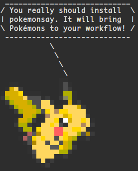

pokemonsay
==========



`pokemonsay` is like [`cowsay`][cowsay] but for pokémon only. It was inspired by [`ponysay`][ponysay] (`cowsay` for ponies). Internally, `pokemonsay` still uses `cowsay`, so you need it installed too (`cowsay`... not `ponysay`).

## Huck's Updates

I've added the whole Pokédex (up to Gen 9 so far) to this repository!

Once you've installed [pokemonsay](https://github.com/possatti/pokemonsay) you'll have to manually add the new .cow files to the `pokemonsay/v*.*.*/cows/` directory on your computer from the `cows/` directory of this repository. I don't know where exactly this is for Ubuntu, but for Mac it's in `/opt/homebrew/Cellar/pokemonsay/v1.0.0/cows`. I could make a quick script to add the files, but I'm lazy & frankly I'm pretty done with this project aside from occasionally adding new Pokémon as they release (hopefully). Just make sure you download [pokemonsay](https://github.com/possatti/pokemonsay) as normal, then replace the `cows/` directory with the one from this repository.

## Installation

### Ubuntu

If you simply want to use `pokemonsay`, the only thing you need installed is `cowsay`. But you are probably interested in `fortune` as well, to provide random sayings to your pokémon. To install them both in Ubuntu, simply run:

```bash
$ sudo apt-get install fortune cowsay
```

If you want to rebuild everything in the repository, you will also need [`img2xterm`][img2xterm]. `img2xterm` is used to generate ".cow files" from the pokémon images. To install it you will need to build from source. The instructions are provided on their repository. And if you know an easier way, please tell me!

Keep in mind that `pokemonsay` will only work if you have `cowsay` installed and available in your `$PATH`. To install `pokemonsay` run these commands in a terminal window:

```bash
$ git clone http://github.com/possatti/pokemonsay
$ cd pokemonsay
$ ./install.sh
```

After the last command, you will have `pokemonsay` installed in you home folder in `~/.pokemonsay/`. And an executable script will be created in `~/bin/pokemonsay`, so that you can have `pokemonsay` in your `$PATH` too.

It may be necessary to logout and login back again to have `pokemonsay` in you `$PATH`. This is specially true if you have never had a `~/bin/` folder before. Your operating system will have it added to you `$PATH` automatically after the `~/bin/` folder is created... I hope.

### OS X

You can install `pokemonsay` through Homebrew. It is pretty straightforward:

```sh
$ brew tap possatti/possatti
$ brew install pokemonsay
```

### Docker

There's an interesting fork by @xaviervia that allows you to run `pokemonsay` on Docker. Check out [xaviervia/docker-pokemonsay](https://github.com/xaviervia/docker-pokemonsay).

## Usage

Now that you've installed `pokemonsay`, you can make it work like so:

```bash
$ pokemonsay Hello World
```

To have a random pokémon saying some random thing to you, use `fortune`:

```bash
$ fortune | pokemonsay
```

And if you really like it, you can add the command above to the end of your `~/.bashrc` file (or equivalent). So you will have a random pokémon speaking to you whenever you open a new terminal window! :D

You get a cowthink-like version too. Try it:

```bash
$ pokemonthink --pokemon Charmander "Should I wear some clothes?"
```

## Uninstall

Just in case you hate Pokémon and you've installed `pokemonsay` "by mistake"... Humpf! You can uninstall it by running:

```bash
$ sh $HOME/.pokemonsay/uninstall.sh
```

## Building the whole thing

In order to use `pokemonsay` you don't need to build anything because everything is built already within the repository. But if you want to download the whole images again or make some change in the process, here is how it's done:

```bash
# Download pokémon images from Bulbapedia... Thanks bulbapedia!
$ ./download_pokemon.py

# Manipulate the downloaded images, to make the pokémon look
# to the right, and trim the useless space around them.
$ ./fix_images.sh

# Use 'img2xterm' to generate .cow files (for 'cowsay').
$ ./make_cows.sh
```

And there it is. Now install it with `install.sh` and you are done.

## Special Thanks

A special thanks to my friend Lucas Coutinho Oliveira (@lucascsoliveira) who helped me with some Pokémon wisdom. Thanks buddy!

## NOTICE

Please notice I don't own Pokémon or anything related to it. Pokémon is property of [The Pokémon Company][the-pokemon-company].

[img2xterm]: https://github.com/Huckdirks/img2xterm
[cowsay]: https://en.wikipedia.org/wiki/Cowsay
[ponysay]: https://github.com/erkin/ponysay
[the-pokemon-company]: https://en.wikipedia.org/wiki/The_Pok%C3%A9mon_Company
